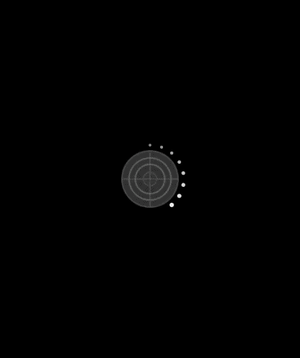
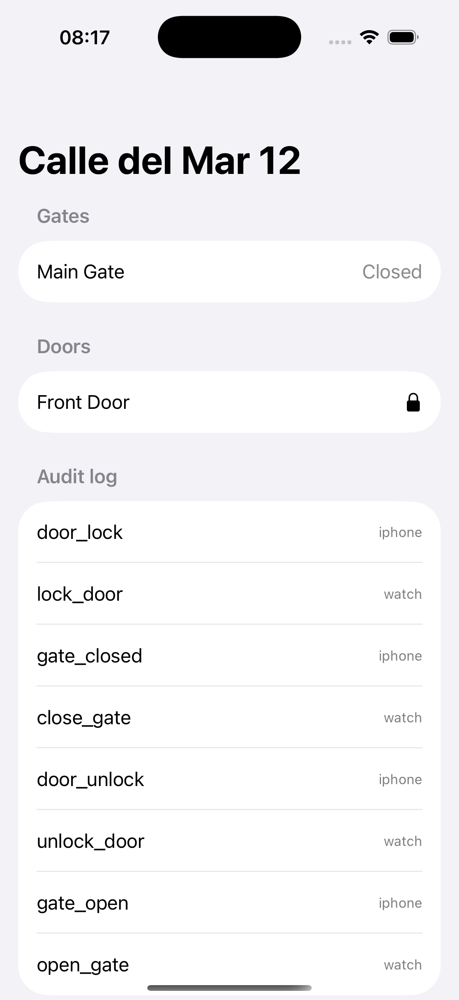
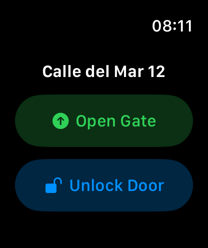
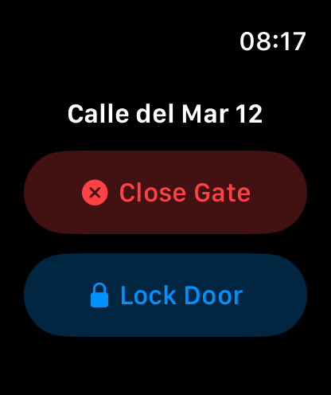
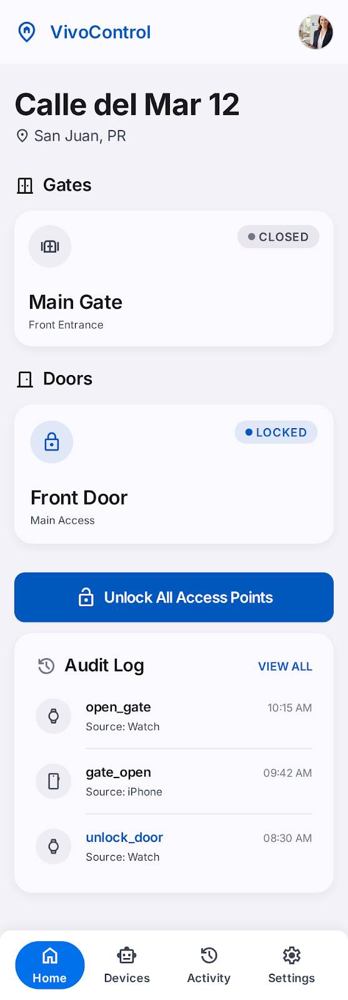
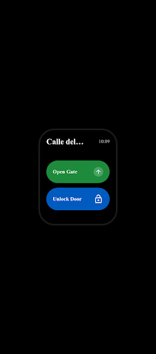
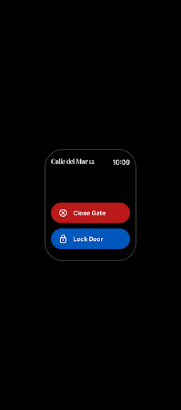

# swift-watchos-companion

A **SwiftUI** iOS + watchOS companion app POC that mirrors the architecture used by residential community control systems (gate/door/camera management). The repo demonstrates the full set of patterns required to ship a watchOS companion to the App Store: paired-device sync via **WatchConnectivity**, watch-face **complications**, background refresh, and a clean shared model layer that lives in a **Swift Package** consumed by both targets. Targets iOS 17+ and watchOS 10+.

## Demo



Recorded on a paired iPhone + Apple Watch simulator pair: each button flip is a real WatchConnectivity round trip - the Watch sends a `CommandEnvelope`, the iPhone mutates state, records the audit entry, and broadcasts the new context back.

## Screenshots

| iOS - Home + Audit Log | Watch - Idle (closed / locked) | Watch - Gate Open / Door Unlocked |
|---|---|---|
|  |  |  |

## Features

- Two app targets: iOS host (`VivoControl`) and watchOS companion (`VivoControlWatch`)
- Shared Swift Package (`Shared`) consumed by both targets - models, transport, and view models are written once and built into both
- `WatchConnectivityClient` supports `sendMessage` (live), `transferUserInfo` (queued), and `updateApplicationContext` (latest-state broadcast)
- Automatic fallback: if the Watch is out of range when a command is issued, `transferUserInfo` queues the action and delivers it on reconnect
- Watch-initiated commands (Open Gate, Unlock Door, Lock Door, Close Gate, Request Snapshot) routed through the iPhone to the backend
- Real-time gate/door state reflected in the Watch UI via `updateApplicationContext`
- `ComplicationController` serving modular, circular, graphic-circular, and graphic-corner watch-face families with live gate state
- `CommandEnvelope` with an idempotency UUID and timestamp so the iPhone can deduplicate replayed queued commands
- Audit log: every state change - whether triggered from the iPhone or the Watch - is recorded with its source (`iphone` / `watch`) and timestamp
- Strict Swift concurrency (`@MainActor`, `Sendable`) throughout - no data races
- Unit tests covering `CommandEnvelope` Codable round-trip and stable audit labels

## Stack

- **Swift / SwiftUI** - both iOS and watchOS UIs, no UIKit shims
- **WatchConnectivity** - bidirectional paired-device communication
- **ClockKit** - watch-face complication data source
- **Swift Package Manager** - `Shared` package consumed by both targets
- **XCTest** - unit tests for the shared model layer
- Minimum deployment: **iOS 17**, **watchOS 10**

## Architecture

```
.
├── iOS/VivoControl/                  # iPhone app target
│   ├── VivoControlApp.swift          # @main entry, seeds mock data, sets up WC session
│   ├── HomeView.swift                # Gates, doors, and audit log list
│   └── PhoneCommandHandler.swift     # Receives Watch commands, mutates state, broadcasts context
├── Watch/VivoControlWatch/           # Apple Watch target
│   ├── VivoControlWatchApp.swift     # @main entry, sets up WC context listener
│   ├── WatchHomeView.swift           # Compact gate/door toggle buttons
│   └── ComplicationController.swift  # Gate state for watch-face complication families
└── Shared/                           # Swift Package consumed by both targets
    ├── Sources/Shared/
    │   ├── Models/
    │   │   ├── Property.swift        # Property, Gate, GateState, Door, Camera
    │   │   └── Command.swift         # WatchCommand enum + CommandEnvelope
    │   ├── Transport/
    │   │   └── WatchConnectivityClient.swift  # Shared WC session manager
    │   └── ViewModels/
    │       └── PropertyViewModel.swift        # ObservableObject shared by both UIs
    └── Tests/SharedTests/
        └── CommandEnvelopeTests.swift
```

```mermaid
flowchart TD
    subgraph iPhone["iPhone (VivoControlApp)"]
        HA[HomeView\nGates / Doors / Audit log]
        VM[PropertyViewModel\n@MainActor ObservableObject]
        PCH[PhoneCommandHandler\nroutes commands to state]
        WCC_iOS[WatchConnectivityClient\nshared singleton]
        MD[Mock seed\nVivoControlApp.init]
    end

    subgraph Watch["Apple Watch (VivoControlWatchApp)"]
        WH[WatchHomeView\nOpen Gate / Lock Door buttons]
        WAS[WatchAppState\n@MainActor ObservableObject]
        WCC_W[WatchConnectivityClient\nshared singleton]
        CC[ComplicationController\ngate state text]
    end

    subgraph Shared["Shared Swift Package"]
        MDL[Models\nProperty / Gate / Door / Camera\nWatchCommand / CommandEnvelope]
        VM2[PropertyViewModel]
        WCLib[WatchConnectivityClient]
    end

    MD -->|seeds Property struct| VM
    HA -->|observes| VM
    VM -->|mutated by| PCH
    WCC_iOS -->|onCommandReceived callback| PCH
    PCH -->|updateApplicationContext| WCC_iOS

    WH -->|tap button| WAS
    WAS -->|send CommandEnvelope| WCC_W
    WCC_W -->|sendMessage / transferUserInfo| WCC_iOS
    WCC_iOS -->|onContextReceived callback| WAS
    WAS -->|drives| WH
    WAS -->|gate state| CC

    Shared --> iPhone
    Shared --> Watch
```

## Design

The UI follows a Google Stitch design (see [`design/`](design/)) - iOS property home plus Watch idle/active states, sharing one design system (deep blue for security actions, green for open states, red for close actions, Inter type scale).

| iOS Home | Watch Idle | Watch Active |
|---|---|---|
|  |  |  |

## Mock data

All data is seeded in-memory in `VivoControlApp.init()` - no server or network calls are required. The seed creates one `Property` with:

- **Property**: name `"Calle del Mar 12"`, address `"San Juan, PR"`
- **Gates**: one gate named `"Main Gate"` with initial state `closed`
- **Doors**: one door named `"Front Door"` with initial state `locked: true`
- **Cameras**: one camera named `"Driveway"` with `snapshotURL: nil` (snapshot fetch is stubbed in `PhoneCommandHandler`)

When a Watch command arrives, `PhoneCommandHandler` mutates the in-memory `PropertyViewModel` directly (the production path would await a backend API call) and immediately broadcasts the new state back to the Watch via `updateApplicationContext`. The `ComplicationController` stubs gate state as `"Closed"` (a production build would read from an App Group `UserDefaults` container).

## Run

1. Open `VivoControl.xcodeproj` in **Xcode 15+** (regenerate anytime with `xcodegen generate` from `project.yml`) with a paired iPhone + Apple Watch simulator pair active.
2. Select the `VivoControl` (iOS) scheme and run on the iPhone simulator.
3. Select the `VivoControlWatch` scheme and run on the paired Watch simulator.
4. Tap "Open Gate" or "Unlock Door" on the Watch - the iPhone audit log updates instantly via WatchConnectivity.

```bash
# Build and test the Shared package (no simulator needed)
swift test --package-path Shared
```
